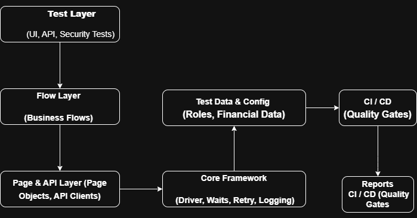

# Quality Engineering Foundation

This repository demonstrates how I design a scalable and maintainable
quality engineering foundation for enterprise systems.

The focus is on:

* Clear separation of concerns
* Stability over test volume
* API-first validation
* CI/CD-friendly execution

## Architectural Principles

* Test logic must not manage infrastructure concerns
* Business flows are modeled explicitly
* High-risk paths are easier to identify and gate
* New teams should onboard with minimal guidance

## Design Decisions

* Layered architecture to reduce coupling
* Limited UI automation, focused on confidence
* API tests as the primary validation layer
* Retry and waits handled centrally, not per test

## Scalability

This structure supports:

* Parallel execution
* Multiple teams contributing
* Extension without refactoring

This foundation is used to support domain projects
such as **FinWealth Pro** or **wealth management/Fintech Applications**.

## Architecture Overview

